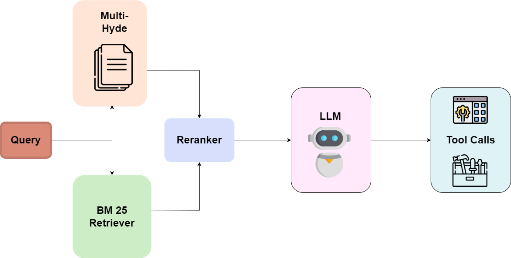
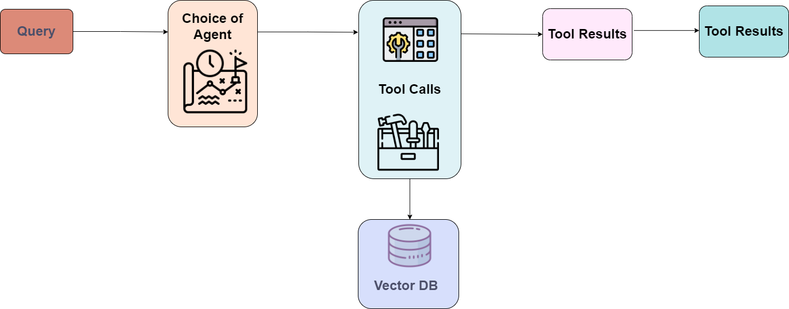
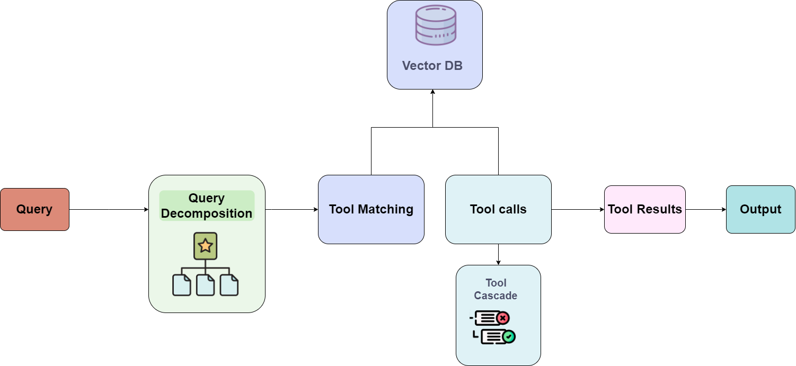
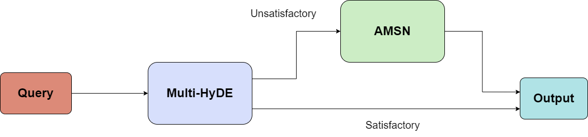
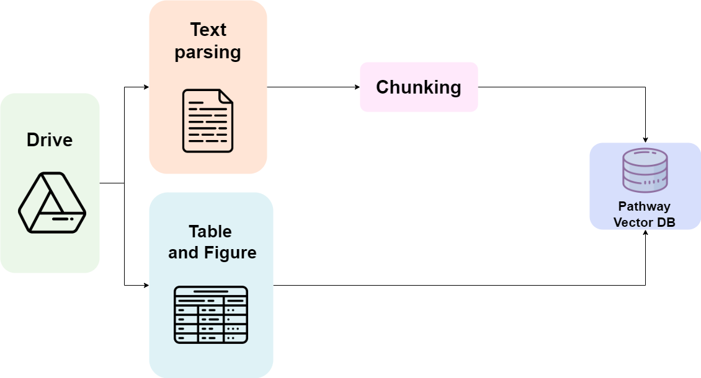

# [Enhancing Financial RAG with Agentic AI and Multi-HyDE: A Novel Approach to Knowledge Retrieval and Hallucination Reduction](https://aclanthology.org/2025.finnlp-2.3/)

We design **SECure RAG**, a framework for streamlining financial data analysis through agentic RAG. It leverages LLMs over both structured and unstructured data sources, using retrievers and tools to gather information from diverse, large-scale sources and process it to answer user queries.

**Paper:** [ACL Anthology](https://aclanthology.org/2025.finnlp-2.3/)  
**PDF:** [Read the paper](https://aclanthology.org/2025.finnlp-2.3.pdf)

Evaluation results are included in `./evaluation results`.
## Installation
### Running UI with Streamlit
1. Enter this directory and install the FinAgent package with the following command (in a virtual environment with python 3.12):
    ```
    pip install -e .
    ```
2. Install streamlit with the following command:
    ```
    pip install streamlit
    ```
3. Set your environment variables in a .env file in the parent folder (or set them by any other method).  
Instructions for obtaining API keys can be found in [API Key Instructions](<./API Key Instructions.md>)
4. Run the app with 
    ```
    streamlit run app.py
    ```
The UI will be hosted at http://localhost:8501/

NOTE: Between queries, the agent should be reset (using the reset button in the UI is sufficient), as follow-ups are treated differently from new queries.

### Hosting locally with FastAPI and docker
(NOTE: This will only work with one client at a time, as it requires resetting the state of the agent between conversations. This is needed to maintain conversation history and allow for explainability)
1. Create the Docker image with the following command from this folder:
    ```
    docker build -t secure_rag .
    ```
2. Run the Docker container with the following command:
    ```
    docker run -p 1524:1524 --env-file .env secure_rag
    ```
3. The FastAPI server will be hosted at http://localhost:1524/.  
    1. To reset the agent, make a PUT request to http://localhost:1524/reset
    2. To make a query, make a POST request to http://localhost:1524/query with the following JSON body:
        ```
        {
            "query": "Your query here"
        }
        ```
        Response will be in the format
        ```
        {
            "messages": [
                {
                    "role": "One of (User, Tool, Guardrail, Assistant)",
                    "content": "Message content",
                },
                ...
            ]
            "iterations": No. of iterations (integer)
        }   
        ```
    3. For explainability, make a POST request to http://localhost:1524/explain with the following JSON body:
        ```
        {
            "query": "Copied text from the assistant to explain",
        }
        ```
        Response will be in the format
        ```
        {
            "explanation": "Explanation text",
        }   
        ```

### Hosting the UI with Docker
1. Create the Docker image with the following command from this folder:
    ```
    docker build -t secure_rag_ui -f Streamlit-Dockerfile .
    ```
2. Run the Docker container with the following command:
    ```
    docker run -p 8501:8501 --env-file .env secure_rag_ui
    ```
3. The UI can be accessed at http://localhost:8501/

NOTES: 
- Between queries, the agent should be reset, as follow-ups are treated differently from new queries.
- Guardrails are not active on the agent's thoughts, plans and queries (visible in the UI in the sidebar), as these would not be visible in a production environment.

## Instructions to Run the VectorStore
This repository contains `PDF Parser` folder which contains the code for our custom document parser integrated with Pathway. There are two retrievers used, one being a dense retriever and other being sparse retriever.
### For Dense Retriever
 The program utilizes the OpenAI model "text-embedding-3-large" to generate embeddings. The vector store reads from the `./to-process/` folder, parses the `.pdf` files, and creates a vector store. To enable the program to read from a Google Drive file, uncomment lines 17-22 in the `vectorstore.py` file.

- Create the virtual environment using `python -m venv .venv`
- Do `pip install -r requirements.txt` to get all the libraries setup.
- The folder `PDF Parser/Dense Retriever` contains the code hosted in our GCP instance. 
- Run `python vectorstore.py`

NOTE: Sometimes, an error occurs when an older version of libgl is present
```
apt-get update && apt-get install -y libgl1-mesa-glx libglib2.0-0
```

#### Enabling Read from Google Drive
- Add the Google Drive object ID and the `credentials.json` file containing the details of your Drive folder.

- Once running, the program exposes port 8666.

- To confirm functionality, run the `rag-tool.py` file.

- For our experiments, we hosted a VM on Google Cloud and exposed the port using ngrok.

### For Sparse Retriever
To get the sparse retriever up follow the below instructions:

- Create the virtual environment using `python -m venv .venv`
- Do `pip install -r requirements.txt` to get all the libraries setup.
- The folder `PDF Parser/Sparse Retriever` contains the code hosted in our GCP instance. 
- Copy the `docParser.py` present in the folder.
- Go to `.venv/lib/python3.11/site-packages/pathway/xpacks/llm` and paste the file in it.
- Run `python app.py`.

## Architecture
### StatelessAgent
- We start in a highly optimised state, which use HyDE with Pathway's Vector Store and Document Store to perform retrieval from out dataset.
- Data is chunked, parsed and embedded dynamically, and new data can be added to a Google Drive folder.
- An agent can use the retrieved data and search the web or use a python-based calculator to answer the query.
- This performs highly accurate retrieval for most queries, but can fail if more complex queries are needed, or if some data is not in the dataset



In this approach, we combine two powerful retrieval methods: the dense retriever **MultiHyDE** and the keyword-based retriever **BM25**. A cross-encoder re-ranker then ranks the retrieved documents. The LLM is equipped with tools to integrate multi-modal data sources, making this approach perfect for pipelines with well-defined data flows.

The LLM generates multiple rephrased versions of the query, creating Hypothetical Document embeddings (HyDE) for each. We retrieve top chunks using both MultiHyDE and BM25, then concatenate and re-rank them to get the most relevant chunks. These chunks, along with their confidence scores, are provided to the LLM.

If more information is needed, the LLM can use tools like **Yahoo Finance**, **Python Calculator**, **Edgar Tool**, and **Bing Web Search** to gather additional data. This ensures comprehensive and accurate responses to user queries.
### MultiState

- We allow the agent to switch to different states, which are optimised for different kinds of queries.
- The agent is free to choose a state to answer the query, and then can follow the instructions in the state to call the right set of tools for financial, statistical, or event-based queries.

  
This approach uses three states (in addition to a Base State with no tools) to handle different types of queries:

1. **Fact-based Finance**
<!-- 2. **Fact-based non-Finance** -->
2. **Statistical Analysis Comparison**
<!-- 4. **Creative Queries** -->
3. **Trend Analysis and Event-Based**

Each state has specific instructions and tools to handle the query efficiently. The agent self-checks the accuracy and completeness of the answer before presenting it to the user.

### MetaState
- The most complex queries may need a combination of several tools, and the master state permits the agent to call any tool in the system.
- The LLM is empowered in this state with plans and query decomposition (in addition to thoughts), through a new system prompt, allowing it to make more complex plans.



Our toolset includes RAG tools like HyDE-based RAG, finance tools like **edgar_tool**, **Alpha Vantage Exchange Rate**, **web_search**, and a **Python calculator**. Users can easily add tools, enabling highly dynamic workflows with custom data sources.

This pipeline allows AI agents to autonomously manage the RAG process and perform actions beyond simple information retrieval, accessing live information for more dynamic workflows.

### Final Pipeline



- Our experiments showed that our best pipelines were the Stateless and MetaState approaches. 
- Therefore, our Final Pipeline integrates StatelessAgent and MetaState, starting the agent with **useful outputs from HyDE**, while letting it follow up with tool calls to get missing information, with the **large number of tools of MetaState**


## Features
- **Robust and accurate** data retrieval both from websites and from privately hosted databases.
- **Agentic system** which **handles and corrects tool calls** for adaptive retrieval. 
- Capable of handling **multiple data sources** and retrieve from **large databases** (provided sufficient resources for hosting the vector store).
- A **thoughts, tools and audio approach**, allowing the agent to separate its internal thoughts, tool calls and user-facing responses.

- Easily **modifiable configuration** for new use cases, as states and prompts can be changed (in FinAgent/config/).
- Accurate guardrails, for both **user input and agent output**
- Streamlit frontend for chatting, with a **transparent thought process** and a page which explains user-chosen portions of the agent's output.


### A Wide and Extensible Range of Tools
- Our system treats both retrievers and API calls as tools, which can easily be added or removed.
- The system is designed to be easily extensible, with a wide range of tools already available.
- Tools can be called asynchronously (when not dependent on each other) to make multiple API calls at once.

### Robust PDF Parser

We use a PDF parsing system, illustrated in the figure below, implemented in Python with the **Docling** library and integrated with Pathway to extract and organize data from intricate documents. This system processes text, tables, and images, exporting tables in HTML format. 

The system produces structured text data in JSON format. We manage table embeddings by performing row-and-column aggregation on the parsed tables in HTML format. This solution effectively tackles document processing challenges with high accuracy and scalability, especially in enterprise scenarios that require structured insights from unstructured PDFs. **We have developed a base class for Pathway to integrate with Pathway's ETL Library, ensuring seamless compatibility for custom parsers**.


### Easily Configurable
- The system is designed to be easily configurable, with the ability to change the states, tools, and prompts.
- Models can easily be customised for every state, and our system supports Gemini, OpenAI, Groq, Ollama and any LiteLLM model. Other models can easily be added to our models as well (at FinAgent/models/models.py).
- States and prompts can be added to config.py, and tools can be added to FinAgent/tools/ or FinAgent/retrievers/.
- The system can even be extended to handle agents that modify their system prompt, or call certain tools by default, if a new and improved pipeline is developed.

## Configuration
Our system is highly configurable, with the ability to change the states, tools, prompts and agents.

Agents are defined in FinAgent/agents.py
Prompts are defined in FinAgent/config/prompts.py
States are defined in FinAgent/config/states.py
Tools are defined in FinAgent/tools/ and imported into states.py for initialisation and assignment to states.

### Environment variables (can be defined in a .env file in the parent folder, or with docker run --env-file)
```
USE_GUARDRAIL (optional, defaults to False in agent_page.py)
PATHWAY_VECTOR_STORE_URL=
HYDE_BM25_URL=
GEMINI_API_KEY=
GROQ_API_KEY=
OPENAI_API_KEY=
BING_SEARCH_API_KEY=
REPLICATE_API_KEY=
WOLFRAM_ALPHA_APPID=
ALPHAVANTAGE_API_KEY=
ASKNEWS_CLIENT_ID=
ASKNEWS_CLIENT_SECRET=
FINPREP_API_KEY=
```
information on getting API keys is in [API Key Instructions](<./API Key Instructions.md>)

### Changing Prompts
- Prompts are defined in FinAgent/config/prompts.py, and can be easily changed for the built-in agents. 
- If you wish to make the prompt change with the state, we use str.format to accomplish this in `Agent.set_system_prompt()`.  
For this use case, we include a helper function in prompts.py to escape {} and use different characters (such as <>) in their place. 
### Changing States and Tools
- New sets of states can easily be added in FinAgent/config/states.py
- Tools are initialised in states.py and assigned to states. These can be added or removed there. The format of tools and states are shown [here](<./Adding new tools.md>).
- States contain their own instructions, and are added to the prompt in place of `{state_details}` (optionally, depending on `Agent.set_system_prompt`)
### Switching Agents
- Agents are defined in FinAgent/agents.py, and can be easily switched by changing the agent in `agent_page.py` and `main.py`
- This can be accomplished by choosing the class of the agent in `config` (a dictionary in both the files)


## Citation

If you use this repository, please cite the associated paper:

```bibtex
@inproceedings{george-etal-2025-enhancing,
    title = "Enhancing Financial {RAG} with Agentic {AI} and Multi-{H}y{DE}: A Novel Approach to Knowledge Retrieval and Hallucination Reduction",
    author = "George, Ryan  and
      Srinivasan, Akshay Govind  and
      Joe, Jayden Koshy  and
      R, Harshith M  and
      J, Vijayavallabh  and
      Kant, Hrushikesh  and
      Vimalkanth, Rahul  and
      S, Sachin  and
      Suresh, Sudharshan",
    editor = "Chen, Chung-Chi  and
      Winata, Genta Indra  and
      Rawls, Stephen  and
      Das, Anirban  and
      Chen, Hsin-Hsi  and
      Takamura, Hiroya",
    booktitle = "Proceedings of The 10th Workshop on Financial Technology and Natural Language Processing",
    month = nov,
    year = "2025",
    address = "Suzhou, China",
    publisher = "Association for Computational Linguistics",
    url = "https://aclanthology.org/2025.finnlp-2.3/",
    doi = "10.18653/v1/2025.finnlp-2.3",
    pages = "19--32"
}
```
